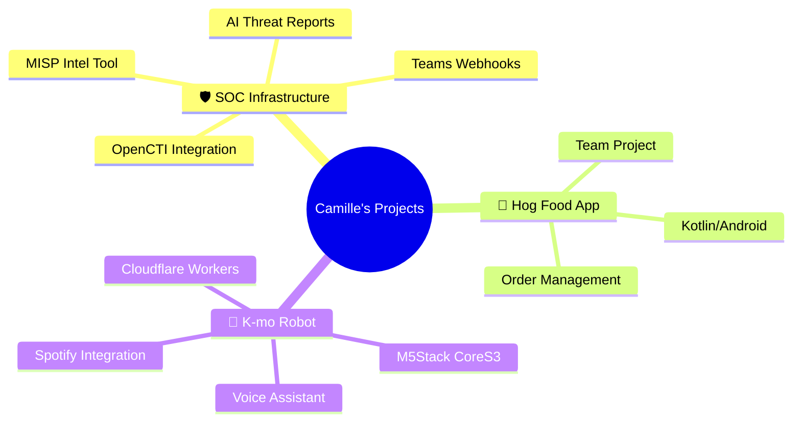

# Hi there! 👋 I'm Camille

<div align="center">
  
  [](https://git.io/typing-svg)
  
</div>

Kamilė Zajančkauskaitė - Software Engineering student at Vilnius TECH 🇱🇹

---

## 🐍 Watch the snake eat my contributions!

<picture>
  <source media="(prefers-color-scheme: dark)" srcset="https://raw.githubusercontent.com/Camishire/Camishire/output/github-snake-dark.svg">
  <source media="(prefers-color-scheme: light)" srcset="https://raw.githubusercontent.com/Camishire/Camishire/output/github-snake.svg">
  
</picture>

---

## 💻 Tech Stack

<div align="center">


</div>

### 🛡️ Cybersecurity Tools
```
OpenCTI • MISP • Elastic/Kibana • Wazuh • Cloudflare Workers
```

---

## 📊 GitHub Stats

<div align="center">
  
  
  

</div>

<div align="center">
  
  [](https://git.io/streak-stats)
  
</div>

---

## 🎯 Currently Working On



<details>
<summary>🔍 Click to see more details</summary>

### 🛡️ SOC Threat Intelligence Infrastructure
- **OpenCTI** custom connectors & GraphQL automation
- **MISP** Intelligence Submission Tool (FastAPI + vanilla JS)
- AI-powered threat reporting (Groq API + LLaMA 3.3)
- Real-time Microsoft Teams integration
- SOC IP Lookup tool with NFC authentication

### 📱 Hog Food Android App
- Kotlin/Android development with team
- Order history with real-time polling
- Bearer token authentication
- Unit testing with MockK
- GitHub Actions CI/CD pipeline

### 🤖 K-mo Voice Assistant Robot
- M5Stack CoreS3 hardware
- Groq Whisper STT + LLaMA-3.3-70b
- Cloudflare Workers backend
- Features: Spotify, Discord, reminders, weather, morning briefing

</details>

---

## 🏆 GitHub Trophies

<div align="center">
  
  [](https://github.com/ryo-ma/github-profile-trophy)
  
</div>

---

## 📈 Contribution Activity

<!--START_SECTION:activity-->
<!--END_SECTION:activity-->

---

## 🎵 Spotify Playing

<div align="center">

[](https://spotify-github-profile.kittinanx.com/api/view?uid=31ntrplkhwckrcd4rmeonawhgfka&redirect=true)

</div>

---

## 💬 Random Dev Quote

<div align="center">


</div>

---

## 🌟 Visitor Count

<div align="center">
  
  
  
</div>

---

## 📫 Connect with Me

<div align="center">

[](https://www.linkedin.com/in/kamilezajanckauskaite/)
[](https://www.fiverr.com/s/BRXWPry)
[](https://github.com/Camishire)

</div>

---

<div align="center">
  
  ### 💖 Thanks for visiting!
  
  
  
  *"The only way to do great work is to love what you do." - Steve Jobs*
  
</div>
